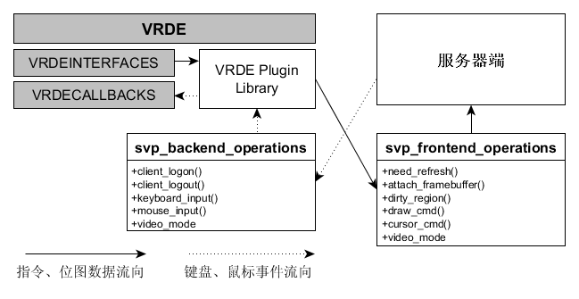
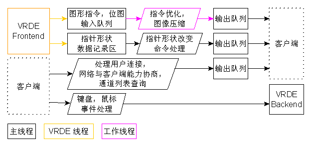
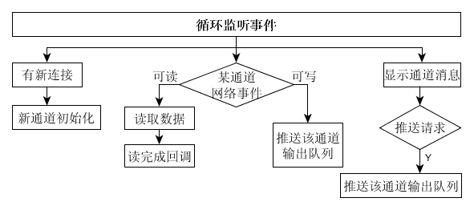
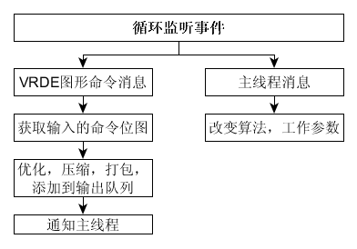
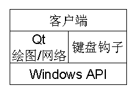
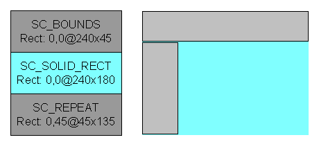
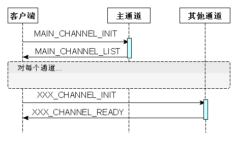

## **SVP协议**

### **一、介绍**

SVP(Simple Virtualization Protocol)，是一个高性能，低带宽的远程呈现协议及解决方案。

它的定位类似于RDP,VNC等，最主要的功能是作为一个通信协议，使用户能远程访问虚拟机，处理用户键盘鼠标输入，并将虚拟机的画面等在用户的远程计算机上呈现。

它是一个VirtualBox的扩展，他将虚拟机的画面在用户的远程桌面客户端。

### **二、架构**

![] (images/svp-arch.png)

SVP协议即服务器端和客户端通信的规范。

它是一个多通道的架构。一个通道对应于一对网络通信套接字，不同类型数据通过不同通道发送。

#### **1. VRDE 扩展**

#### **2. 服务器端**

每个通道对应于一个端口。

所有客户端相关通道的通信在主线程中处理。

**2.1 指令，位图处理**

1. VRDE向我们服务器端推送更新数据。

2. 在VRDE所在线程中我们拷贝指令，位图，将其放到一个队列中，然后向主线程发出通知。

3. 主线程收到通知，获取数据，将其委托给一个工作线程处理。

4. 工作线程处理图像预处理，压缩等操作，将打包后待发送的数据放到输出队列中，通知主线程。

5. 主线程当发现输出队列有数据，且对应网络套接字空闲可发送数据时，发送数据。
	
**2.2 鼠标，键盘输入**

1. 主线程收到客户端发送过来的键盘，鼠标事件数据包。

2. 调用VRDE提供的接口通知虚拟机处理键盘，鼠标事件。

**2.3 主线程**

**2.4 工作线程**

#### **3. 客户端**

每个通道都创建一个线程，处理网络通信和数据解压，渲染等。

客户端知道服务器地址和主通道端口号。

客户端先建立好主通道连接，然后通过与主通道通信，获得其他通道的端口号，建立连接。

#### **4. 数据格式**

##### 4.1 VRDE ---> 服务器端

- `SC_DIRTY_RECT`
	
	位图。 

- `SC_SOLID_RECT`

	带颜色实心矩形。

- `SC_SOLID_BLT`

	将某颜色与某矩形区域做指定的ROP光栅操作。

- `SC_DST_BLT`

	将某矩形区域做指定的ROP光栅操作。

- `SC_SCREEN_BLT`

	将某源区域与某目标区域做指定的ROP光栅操作。

- `SC_PATTERN_BLT_BRUSH`

	将某画刷与某目标区域做指定的ROP光栅操作。

- `SC_MEM_BLT`

	将缓存中位图上屏显示。

- `SC_CACHED_BITMAP`

	缓存位图，不显示，供将来的`SC_MEM_BLT`指令显示。

- `SC_DELETED_BITMAP`

	丢弃某个缓存中的位图。

- `SC_LINE`

	画线。

- `SC_BOUNDS`

	裁剪矩形，在绘图命令之前。指定后续绘图操作必须只在该范围内生效。 

- `SC_REPEAT`

	一个或多个裁剪矩形，在绘图命令之后，与其他`SC_BOUNDS`和`SC_REPEAT`指令一起指定了个大的裁剪区域。

	

- `SC_POLYLINE`

	画折线。

- `SC_ELLIPSE`

	画椭圆。

- `SC_SAVE_SCREEN`

	保存或恢复屏幕某块区域。

- `SC_TEXT`

	文字，含坐标、颜色一串字符，每个字符由1bit位图指定轮廓。

##### 4.2 客户端 <---> 服务器端

- `pac_hdr`
 
	报文头部。

- `SC_MAIN_CHANNEL_INIT`
	
	主通道初始化。 

- `SC_CHANNEL_LIST`

	其他通道列表，作为 `SC_MAIN_CHANEL_INIT` 的回复。 

- `SC_CHANNEL_INIT`
 	
	其他通道初始化。

- `SC_CHANNEL_READY`

	其他通道就绪，作为 `SC_CHANNEL_INIT` 的回复。

- `SC_KEYBOARD_EVENT`
	
	键盘事件。 	
 
- `SC_MOUSE_EVENT`

	鼠标事件。

- `SC_SCREEN_INFO`

	屏幕分辨率信息。

- `SC_CURSOR`

	指针形状。

- `SC_DIRTY_RECT`，`SC_TEXT` `...`
 
 	这些报文格式同VRDE送过来的格式相同，参照上节描述。

##### 4.3 连接初始化

类似于SPICE。